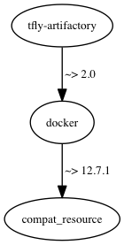

tfly-artifactory Cookbook
=========================
This cookbook runs Artifactory as a Docker container

### Cookbook Dependency Graph


Requirements
------------
#### packages
- `docker` - tfly-artifactory needs Docker in order to install Artifactory.

Attributes
----------

#### tfly-artifactory::default
<table>
  <tr>
    <th>Key</th>
    <th>Type</th>
    <th>Description</th>
    <th>Default</th>
  </tr>
  <tr>
    <td><tt>['tfly-artifactory']['version']</tt></td>
    <td>String</td>
    <td>Version of Artifactory to install</td>
    <td><tt>4.5.2</tt></td>
  </tr>
  <tr>
    <td><tt>['tfly-artifactory']['repo']</tt></td>
    <td>String</td>
    <td>Artifactory repo to use</td>
    <td><tt>docker-reg2.bintray.io/jfrog/artifactory-pro</tt></td>
  </tr>
  <tr>
    <td><tt>['tfly-artifactory']['java-options']</tt></td>
    <td>String</td>
    <td>Artifactory Java options</td>
    <td><tt>-server -Xms512m -Xmx2g -Xss256k -XX:+UseG1GC</tt></td>
  </tr>
  <tr>
    <td><tt>['tfly-artifactory']['docker-host-mapping']</tt></td>
    <td>String</td>
    <td>Docker mappings from fqdn to repo</td>
    <td><tt>
      <pre>
docker-dev.ticketfly-dev.com => docker-dev-local
docker.ticketfly-dev.com => docker-prod-local
      </pre>
    </tt></td>
  </tr>
  <tr>
    <td><tt>['tfly-artifactory']['license']</tt></td>
    <td>String</td>
    <td>Artifactory PRO License</td>
    <td></td>
  </tr>
  <tr>
    <td><tt>['tfly-artifactory']['oauth']['google']['id']</tt></td>
    <td>String</td>
    <td>Google OAuth client ID</td>
    <td></td>
  </tr>
  <tr>
  <td><tt>['tfly-artifactory']['oauth']['google']['secret']</tt></td>
    <td>String</td>
    <td>Google OAuth client secret</td>
    <td></td>
  </tr>
  <td><tt>['tfly-artifactory']['oauth']['mysql']['url']</tt></td>
    <td>String</td>
    <td>MySQL URL</td>
    <td></td>
  </tr>
  <td><tt>['tfly-artifactory']['oauth']['mysql']['username']</tt></td>
    <td>String</td>
    <td>MySQL username</td>
    <td></td>
  </tr>
  <td><tt>['tfly-artifactory']['oauth']['mysql']['password']</tt></td>
    <td>String</td>
    <td>MySQL password</td>
    <td></td>
  </tr>
  <td><tt>['tfly-artifactory']['s3']['identity']m</tt></td>
    <td>String</td>
    <td>S3 Access Key ID</td>
    <td></td>
  </tr>
  <td><tt>['tfly-artifactory']['s3']['credential']</tt></td>
    <td>String</td>
    <td>S3 Secret Access Key</td>
    <td></td>
  </tr>
  <td><tt>['tfly-artifactory']['s3']['endpoint']</tt></td>
    <td>String</td>
    <td>S3 Endpoint</td>
    <td></td>
  </tr>
  <td><tt>['tfly-artifactory']['s3']['bucket-name']</tt></td>
    <td>String</td>
    <td>S3 Bucket Name</td>
    <td></td>
  </tr>
</table>

Usage
-----
#### tfly-artifactory::default

Just include `tfly-artifactory` in your node's `run_list`:

```json
{
  "name":"artifactory-node",
  "run_list": [
    "recipe[tfly-artifactory]"
  ]
}
```
